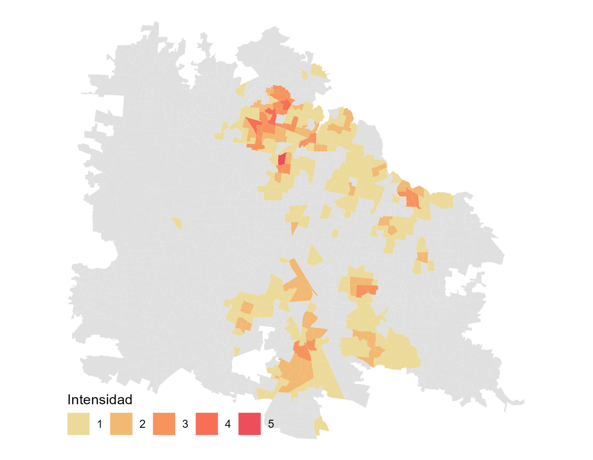
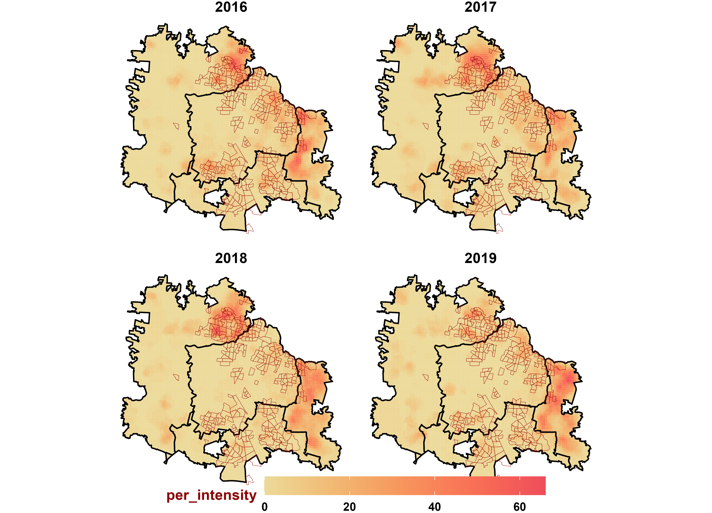

```{r xaringan-fit-screen, echo=FALSE}
xaringanExtra::use_fit_screen()
```

```{r xaringanExtra, echo = FALSE}
xaringanExtra::use_progress_bar(color = "#0051BA", location = "top")
```

```{r xaringan-tachyons, echo=FALSE}
xaringanExtra::use_tachyons()
```

```{r share-again, echo=FALSE}
xaringanExtra::use_share_again()
```


## Temas 

&nbsp;

### a) Línea de tiempo del programa.

### b) Definición de los Hotpots. 

### c) Hotspots de los Casos y Hotspots del Vector.

### d) Cadenas de Transmisión.

### e) Spatial Log Gausaian Cox Procces

### f) Modelo estratégico de focalización de dengue en áreas urbanas

---

### Ciclo de Vida del Programa de Prevención y Control del Dengue

```{r, dpi=300,echo=FALSE, fig.align ="center", out.height="80%",out.width = "100%"}
DiagrammeR::grViz("digraph {

  # graph definitions
  graph [layout = dot, rankdir = TB]
  
  # node definitions
  node [shape = circle, style = filled, color = grey,
  fixedsize = true, width = 2] 
  
  ###########
  prog_den [label = 'Programa de Dengue',  fillcolor =  'DodgerBlue', color = 'white', fontcolor = 'black']
  brote [label = 'Brote',  fillcolor = 'DarkOrange', color = 'white', fontcolor = 'black']
   cp [label = 'Control de Probables',  fillcolor = 'DarkOrange', color = 'white', fontcolor = 'black']
   node [shape = circle, style = filled, color = grey] 
    irs [label = 'Rociado Residual',  fillcolor = 'DarkOrange', color = 'white', fontcolor = 'black']
   cl [label = 'Control Larvario',  fillcolor = 'DarkOrange', color = 'white', fontcolor = 'black']
   ovitraps [label = 'Ovitrampas',  fillcolor = 'DarkOrange', color = 'white', fontcolor = 'black']
  adult [label = 'Colecta de Adultos',  fillcolor = 'DarkOrange', color = 'white', fontcolor = 'black']
  enc_ver [label = 'Encuesta Verificación',  fillcolor = 'DarkOrange', color = 'white', fontcolor = 'black']
   plat [label = 'Plataforma',  fillcolor = 'DarkOrange', color = 'white', fontcolor = 'black']
  
  #########
  node [shape = rectangle, style = filled, color = grey, fixedsize = true, width = 2.5] 
  hotspots [label = 'Hotspots',  fillcolor = 'DarkOrange', color = 'white', fontcolor = 'black']
  act [label = 'Casos Actuales',  fillcolor = 'DarkOrange', color = 'white', fontcolor = 'black']
 
  epi [label = 'Vigilancia Epidemiológica',  fillcolor = 'SeaGreen', color = 'white', fontcolor = 'black']
  ent [label = 'Vigilancia Entomológica',  fillcolor = 'SeaGreen', color = 'white', fontcolor = 'black']
 ind [label = 'Indicadores',  fillcolor = 'SeaGreen', color = 'white', fontcolor = 'black']
  ###################
  prog_den -> {epi, ent}[penwidth = 4]
  
  
  act -> {
  brote[arrowhead = crow, arrowtail = box, color = 'Maroon']
  cp[arrowhead = crow, arrowtail = box, color = 'Maroon']
  } -> plat[penwidth = 4]
  epi -> {act, hotspots}[penwidth = 4]
  hotspots -> {
  cl[arrowhead = crow, arrowtail = box, color = 'Maroon']
  irs[arrowhead = crow, arrowtail = box, color = 'Maroon']
  } -> plat[penwidth = 4]
  ent -> {adult, 
  ovitraps,
  enc_ver} -> plat[penwidth = 4]  
  plat -> ind[penwidth = 4]
  ind -> prog_den[penwidth = 4]
  #ind -> {enc_ver, ovitraps, adult, cl, irs, cp, brote}

 
 
 
  }", 
  height = 600)

```

---
### Línea de tiempo de la información epidemiológica & entomológica

```{r,dpi=300, echo=FALSE, fig.align ="center", out.height="80%", out.width = "100%"}
library(timevis)
a <- timevis::timevis(data = data.frame(start = c("2008-01-01", 
                                                  "2011-01-01",
                                                  "2017-01-01",
                                                  "2017-01-01",
                                                  "2008-01-01",
                                                  "2021-01-01", 
                                                  "2021-03-01"),
                                        end = c("2021-03-31", 
                                                "2021-03-31", 
                                                "2019-12-31",
                                                "2019-12-31", 
                                                "2020-12-31", 
                                                "2021-03-31", 
                                                "2021-03-31"),
                          #style = c("color: darkblue; font-size: 15px; border-color: darkblue; border: 2px solid darkblue;"),
                          content = c("Vigilancia Epidemiológica Pasiva", 
                                      "Vigilancia Entomológica con Ovitrampas", 
                                      "Vigilancia Entomológica con Adultos",
                                      "Entomovirología",
                                      "Hotspots Históricos",
                                      "Actuales (clusters de casos y cadenas de transmisión)",
                                      "Transmisión Activa (Identificación de cadenas de transmisión: knox test)"),
                          #type = c("background"),
                          style = c("text-align: center; font-weight: bold; color: black; font-size: 15px; border-color: darkred; border: 2px solid black; background-color: firebrick;",
                                    "text-align: center; font-weight: bold; color: black; font-size: 15px; border-color: darkblue; border: 2px solid black; background-color: dodgerblue;",
                                    "text-align: center; font-weight: bold; color: black; font-size: 15px; border-color: darkblue; border: 2px solid black; background-color: dodgerblue;", 
                                    "text-align: center; font-weight: bold; color: black; font-size: 15px; border-color: darkgreen; border: 2px solid black; background-color: darkgreen;",
                                    "text-align: center; font-weight: bold; color: black; font-size: 15px; border-color: darkorange; border: 2px solid black; background-color: darkorange;", 
                                    "text-align: left; font-weight: bold; color: black; font-size: 15px; border-color: darkorange; border: 1.5px solid black; background-color: darkorange;", 
                                    "text-align: righ; font-weight: bold; color: black; font-size: 15px; border-color: darkorange; border: 1px solid gray; background-color: darkorange;"),
                          group = c(1, 2, 2,3, 4, 4,4)),
        groups = data.frame(id = 1:4, 
                            content = c("Paciente", 
                                        "Vector",
                                        "Virus-Vector",
                                        "Análisis espacial"),
                            style = c("text-align: center; font-weight: bold; color: black; font-size: 20px; border-color: darkred; border: 2px solid black; background-color: firebrick;",
                                      "text-align: center; font-weight: bold; color: black; font-size: 20px; border-color: darkblue; border: 2px solid black; background-color: dodgerblue;",
                                      "text-align: center; font-weight: bold; color: black; font-size: 20px; border-color: darkgreen; border: 2px solid black; background-color: darkgreen;",
                                      "vertical-align: middle; text-align: center; font-weight: bold; color: black; font-size: 20px; border-color: darkorange; border: 2px solid black; background-color: darkorange;")))

a


style <- "
.vis-time-axis { 
background-color: lightgray;
backgroud-border: 3px solid #73AD21;
backgroun-opacity; 0.1;
font-weight: bold;
text-align: center;
vertical-align: middle;
border: 1.5px solid #73AD21;
font-size: 15px;}
.vis-odd {
color: blue;
vertical-align: middle;
  }

"
htmltools::html_print(htmltools::tagList(htmltools::tags$style(style), a))

```


---
class: center, middle

### Hotspots de la Transmisión de Dengue
.pull-left[
1. Bajar las bases de datos del **[SINAVE](https://www.sinave.gob.mx/)**.
2. Geocodificar las bases.
3. Bajar los shapefile del **[INEGI](https://www.inegi.org.mx/)**.
4. Seleccionar la localidad de interes y extraer los AGEBs.
5. Contar el número de casos por AGEB.
6. Cálcular el Z-score de los casos.
7. Generar la matriz de adjacencias.
8. Cálcular el estadístico espacial local Getis&Ord $\color{#2ECC40}G_{\color{#2ECC40}i}^{\color{#2ECC40}*}$.
9. Realizar la la corrección de Bonferroni.
10. Cálcular los hotspots.
11. Visualizar los hotspots.
]
.pull-right[
```{r, dpi=300,echo=FALSE, fig.align ="center", out.width = "100%"}
DiagrammeR::grViz("digraph {

  # graph definitions
  graph [layout = dot, rankdir = TB]
  
  # node definitions
  node [shape = rectangle, style = filled, color = grey] 
  
  # flowchart for hotspots
  sinave [label = 'SINAVE',  fillcolor = 'SeaGreen', color = 'white', fontcolor = 'white']
  denv [label = 'Bases de DENV',  fillcolor = 'SeaGreen', color = 'white', fontcolor = 'white']
  geocode [label = 'Geocodificación',  fillcolor = 'SeaGreen', color = 'white', fontcolor = 'white']
  cases_ageb [label = 'Casos por AGEBs']
  z_score [label = 'Z-score']
  gi [label = 'Estadístico Espacial Local (Gi*)']
  bonferroni [label = 'Corrección de Bonferroni']
  hotspots [label = 'Hotspots', style = filled, color = orange]
  
  # flow chart for inegi
  inegi [label = 'INEGI', fillcolor = 'DeepSkyBlue', color = 'white', fontcolor = 'black']
  loc [label = 'Localidades Shapefile', fillcolor = 'DeepSkyBlue', color = 'white', fontcolor = 'black']
  ageb [label = 'AGEB Shapefile', fillcolor = 'DeepSkyBlue', color = 'white', fontcolor = 'black']
  loc_esp [label = 'Localidad de Ínteres', fillcolor = 'DeepSkyBlue', color = 'white', fontcolor = 'black']
  ageb_esp [label = 'AGEBs de la Localidad de Ínteres', fillcolor = 'DeepSkyBlue', color = 'white', fontcolor = 'black']
  mat [label = 'Matriz de Adjacencias', fillcolor = 'DeepSkyBlue', color = 'white', fontcolor = 'black']
  
  # edge definitions with the node IDs
  edge [color = black]
  sinave -> denv -> geocode -> cases_ageb -> z_score -> gi -> bonferroni -> hotspots 
  inegi -> {ageb, loc}
  loc -> loc_esp -> ageb_esp
  ageb -> ageb_esp
  ageb_esp -> mat
  mat -> cases_ageb 
 
  }", 
  height = 550)

```
]

.tiny[.blue[.footnote[Dzul-Manzanilla et al 2021.]]]
---

### Hotspots del Vector

```{r, echo=FALSE,dpi=300,  fig.align ="center",out.height="70%", out.width = "90%"}
DiagrammeR::grViz("digraph {

  # graph definitions
  graph [layout = dot, rankdir = TB]
  
  # node definitions
  node [shape = rectangle, style = filled, color = grey] 
  
  #
  cenaprece [label = 'CENAPRECE',  fillcolor = 'SeaGreen', color = 'white', fontcolor = 'white']
  ovitrap [label = 'Ovitrampas',  fillcolor = 'SeaGreen', color = 'white', fontcolor = 'white']
  coord [label = 'Coordenadas',  fillcolor = 'SeaGreen', color = 'white', fontcolor = 'white']
  ovicoord [label = 'ovi + coord']
  
  # flow chart for inegi
  inegi [label = 'INEGI', fillcolor = 'DeepSkyBlue', color = 'white', fontcolor = 'black']
  loc [label = 'Localidades Shapefile', fillcolor = 'DeepSkyBlue', color = 'white', fontcolor = 'black']

  ###
  mesh [label = '1. Mesh']
  spde [label = '2. SPDE']
  
  proj_train [label = '3a. Projector Matrix A. Test']
  proj_test [label = '3b. Projector Matrix A. Train']
  
  spatial_field [label = '4. Spatial Field W']
  
  stack_train [label = '5a. Stack Train']
  stack_test [label = '5b. Stack Test']
  stack_pred [label = '5c. Stack Prediction']
  stack_joint [label = '6. Joint Stack']
  
  formula [label = '7. Formula']
  inla [label = '8. INLA',  fillcolor = 'Orange', color = 'white', fontcolor = 'white']
  
 
  
  # edge definitions with the node IDs
  edge [color = black]
  cenaprece -> {ovitrap, coord} -> ovicoord
  #
  inegi -> loc -> ovicoord
  #
  ovicoord -> mesh
  mesh -> spde -> spatial_field ->  stack_joint
  spde -> {proj_train,  proj_test}
  spatial_field -> {stack_test, stack_train, stack_pred} ->  stack_joint -> formula -> inla 
  proj_train -> stack_train
  proj_test -> stack_test

  
  }", 
  height = 500)

```

---

### Hotspots del Vector

```{r, echo=FALSE,dpi=300, fig.align ="center", out.height="70%", out.width = "90%"}
DiagrammeR::grViz("digraph {

  # graph definitions
  graph [layout = dot, rankdir = TB]
  
  # node definitions
  node [shape = rectangle, style = filled, color = grey] 
  
  #
  
  inla [label = '8. INLA',  fillcolor = 'Orange', color = 'white', fontcolor = 'white']
  stat [label = '9. Statistics']
  
  zeros [label = '9.1. % Zeros']
  disp [label = '9.2. Dispersion Statistics']
  dic [label = '9.3. Deviance Information Criterio']
  pear [label = '9.4. Pearson Residuals']
  
  ##
  p [label = 'Poisson']
  zip [label = 'ZeroInflated Poisson']
  nb [label = 'Negative Binomial']
  zinb [label = 'ZeroInflated Poisson Negative Binomial']
  
  sel [label = '10.Select the Distribution & Model']
  
  # prediction ####
  ext_pred [label = '11. Extract Index Prediction']
  coor_pred [label = '12. Extract Coordinates Prediction']
  pred [label = '13. Prediction']
 
  hotspots [label = '14.Hotspots', fillcolor = 'Orange', color = 'white', fontcolor = 'white']
  save [label = '15. Save results']
  
  mappred [label = '15a. Prediction Map']
  hotspotsb [label = '15b. Hotspots']
  dics [label = '15c. DICs']
  loc [label = '15d. Locality']
  data [label = '15e. Dataset']
  
  # edge definitions with the node IDs
  edge [color = black]
  inla -> stat
  stat -> {zeros, disp, dic,pear} -> {p, zip, nb, zinb} -> sel
  sel -> ext_pred -> coor_pred -> pred -> hotspots -> save
  save -> {mappred, hotspotsb, dics, loc, data}

  
  }", 
  height = 500)

```


---

### Estadístico Espacial Local $\color{#2ECC40}G_{\color{#2ECC40}i}^{\color{#2ECC40}*}$ (Hotspots)


$$\color{#2ECC40}G_{\color{#2ECC40}i}^{\color{#2ECC40}*} = \frac{\color{#FF4136}\sum_{\color{#FF4136}j \color{#FF4136}= \color{#FF4136}1}^\color{#FF4136}{n} \color{#FF4136}w_{\color{#FF4136}i\color{#FF4136}j}\color{#FF4136}x_{\color{#FF4136}j}}
{\color{#0074D9}\sum_{\color{#0074D9}j \color{#0074D9}= \color{#0074D9}1}^{\color{#0074D9}n} \color{#0074D9}x_{\color{#0074D9}j}}$$

donde:
 
$\color{#FF4136}\sum_{\color{#FF4136}j \color{#FF4136}= \color{#FF4136}1}^\color{#FF4136}{n} \color{#FF4136}w_{\color{#FF4136}i\color{#FF4136}j}\color{#FF4136}x_{\color{#FF4136}j}$ el numerador, es la suma de los valores $x_{j}$ de la localidad de interes de la unidad espacial de interes $x_{i}$ &
 
  

 
 $\frac{}{\color{#0074D9}\sum_{\color{#0074D9}j \color{#0074D9}= \color{#0074D9}1}^{\color{#0074D9}n} \color{#0074D9}x_{\color{#0074D9}j}}$ el denominador, es la suma de todos los valores $x$ en toda la localidad de interes.


### **Hotspots** 
son las áreas o las unidades espaciales con valores altos de $\color{#2ECC40}G_{\color{#2ECC40}i}^{\color{#2ECC40}*}$ y homogéneos de la unidad espaciales de interes $x_{ij}$. En otras palabras el estadístico espacial, identifica las unidades espaciales $x_{ij}$ con valores altos comparados con el valor promedio de todas la unidades espaciales en la localidad de interes.

---
## Hotspots de la transmisión del Dengue

&nbsp;

.pull-left[

.large[.justify-left[.blue[Los ***hotspots*** de las arbovirosis transmitidas por ***Aedes aegypti*** son definidas como aquellas áreas donde se concentra la mayor carga de la transmisión de los virus del dengue, chikungunya y/ó zika]]]

]
.pull-right[
.blue[Hotspots del área urbana de Guadalajara]

]


.tiny[.blue[.footnote[Dzul-Manzanilla et al 2021.]]]


---
 
### Hotspots del Vector


---

### Cadenas de Transmisión


---
### Cadenas de Transmisión 

---
### Spatial Log Gaussian Cox Process


---
class: center, middle
### Modelo estratégico de focalización 

&nbsp;

.pull-left[
.blue[Concepto]


]
.pull-right[
.blue[Mapa de Riesgo]

]


.tiny[.blue[.footnote[Dzul-Manzanilla et al 2021.]]]


---
## Definición del Modelo estratégico de focalización 
&nbsp;

.pull-left[
- .red[**Áreas con riesgo muy alto de tranmisión**.] Hotposts de casos + hotspots del vector. 

- .orange[**Áreas con riesgo alto de transmisión**.]  Hotspots de transmisión de casos.

- .yellow[**Áreas con riesgo medio de transmisión**.] Hotspots del vector.

- .green[**Áreas con riesgo bajo de transmisión**]. Sin hotspots del vector o hotspots de casos.
]

.pull-right[
Guadalajara
```{r, out.width = "90%", fig.fullwidth =TRUE, fig.width=10, fig.height=2, echo = FALSE, message=FALSE,dpi=300, warning=FALSE}
knitr::include_graphics("figs/map_risk_guadalajara.jpg")
```
]


---

# Thanks!

&nbsp;

- ***email***       :     Userse.dzul.m@gmail.com

- ***celular***     :     228 229 3419

- ***slides***:     https://jolly-edison-c35bbb.netlify.app/

- ***próximo curso***: ***Análisis espacial del dengue en [R](https://cran.r-project.org/) y [Python](https://www.python.org/)***


.footnote[La presentación fue creada via [**xaringan**](https://github.com/yihui/xaringan),
[**revealjs**](https://revealjs.com/),
[remark.js](https://remarkjs.com), [**knitr**](http://yihui.name/knitr),
& [R Markdown](https://rmarkdown.rstudio.com) en [R]() & [RStudio](2.R_Scripts/libs/rstudio_leaflet/rstudio_leaflet.css).]